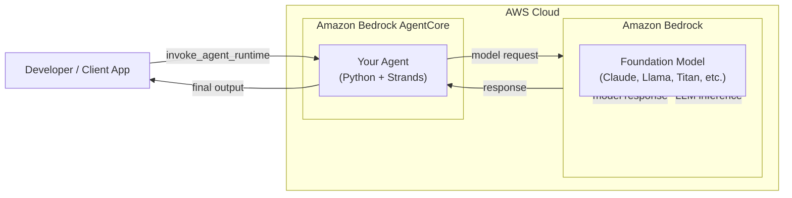
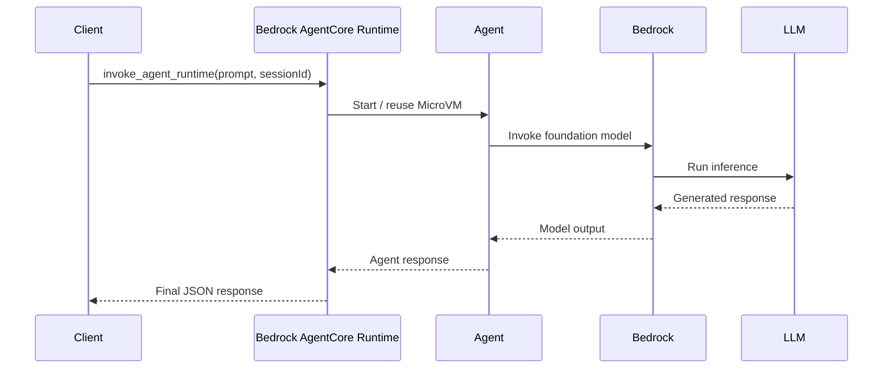

# Bedrock Agent Core - Up and Running

> This tutorial builds upon AWS' [Get started with the Amazon Bedrock AgentCore starter toolkit](https://docs.aws.amazon.com/bedrock-agentcore/latest/devguide/runtime-get-started-toolkit.html)

In this version, we will take what we learned in our first tutorial of building a basic AI Agent to deploy it to Bedrock Agent Core. 

Here is what we'll be doing:

* Build a basic AI Agent in Python
* Deploy it to **Amazon Bedrock AgentCore Runtime** using the Bedrock AgentCore starter toolkit
* Test with Agentcore CLI 
* Test with client App using `boto3` to invoke Agent. 


### Contents

1. [Prerequisites](#prerequisites)
2. [Architecture](#Architecture)
3. [Agent Flow](#agent-workflow)
4. [AWS Authentication](#aws-authentication)
5. [Step 1: Create Project & Virtual Environment](#step-1-create-project--virtual-environment)
6. [Step 2: Install Dependencies](#step-2-install-dependencies)
7. [Step 3: Create the Agent](#step-3-create-the-agent)
8. [Step 4: Run the Agent Locally](#step-4-run-the-agent-locally)
9. [Step 5: Configure for Bedrock AgentCore Deployment](#step-5-configure-for-bedrock-agentcore-deployment)
10. [Step 6: Launch the Agent in Bedrock AgentCore Runtime](#step-6-launch-the-agent-in-bedrock-agentcore-runtime)
11. [Step 7: Invoke the Agent via CLI](#step-7-invoke-the-agent-via-cli)
12. [Step 8: Clean Up Resources](#step-8-clean-up-resources)
13. [Let's a wrap](#lets-a-wrap)


### Prerequisites

| What | Description | 
|--|--|
| [Python 3.10+](https://www.python.org/downloads/) | We will develop the AI Agent with Python | 
| AWS Account | We will host our Agent in AWS' Bedrock Agent Core | 
| Bedrock Agentcore start Toolkist | This will help us package our AI Agent as a container and deploy to AgentCore Runtime|
| Strands (agent framework) | We'll use Strands Framework to build our Agent |
| Docker (required on Apple Silicon) | For local testing |
| Code Editor | VSCode or AWS' Kiro or code editor of choice|


> Important Note - If using Apple Silicon (M1 / M2 / M3) The `strands` Python package does not provide ARM64 wheels and AgentCore Direct Code Deploy disables source builds which results in AgentCore's Start Kit 'Direct Deploy' method timing out. We will therefore use the Container Deployment (Docker) method. 

## Architecture



### Explanation
- Your Agent runs inside Bedrock AgentCore
- AgentCore is the managed runtime (sessions, isolation, lifecycle)
- Amazon Bedrock provides access to Foundation Models
- Your agent does not host or manage the LLM — it calls Bedrock
- AgentCore handles scaling, isolation, and execution
- This diagram is especially useful for people coming from Lambda, ECS and traditional microservices architectures

## Agent Workflow



### AWS Authentication

In order for the AI Agent to access the LLM via Bedrock, we will require a [Bedrock Agent Core API Key](https://docs.aws.amazon.com/bedrock/latest/userguide/api-keys.html)

#### Generate Bedrock API Key

1. Open the AWS Management console and navigate to **IAM** -> **User** -> **Security Credentials** tab
2. Scroll down to the **API keys for Amazon Bedrock**
3. Click **Generate API Key**

#### Add API Key to your environment

Export the API Key as an envirment variable:

```bash
export AWS_BEARER_TOKEN_BEDROCK=<INSERT BEDROCK API KEY>
```

<!-- 
### Configure AWS credentials

```bash
aws configure
```

Or export credentials explicitly:

```bash
export AWS_ACCESS_KEY_ID=xxxxxxxx
export AWS_SECRET_ACCESS_KEY=xxxxxxxx
export AWS_REGION=us-east-1
``` -->

---

## Step 1: Create Project & Virtual Environment

```bash
mkdir agentcore-runtime-quickstart
cd agentcore-runtime-quickstart

python3 -m venv .venv
source .venv/bin/activate
```

## Step 2: Install Dependencies

```bash
pip install bedrock-agentcore strands-agents bedrock-agentcore-starter-toolkit
```

Verify installation:

```bash
agentcore --help
```

## Step 3: Create the Agent

Let's create a simple AI Agent. to begin, create the `agent.py` and `requirements.txt` files:


```bash
touch agent.py requirements.txt
```

### agent.py

```python
from bedrock_agentcore import BedrockAgentCoreApp
from strands import Agent

app = BedrockAgentCoreApp()
agent = Agent()

@app.entrypoint
def invoke(payload):
    user_message = payload.get("prompt", "Hello! How can I help you today?")
    result = agent(user_message)
    return {"result": result.message}

if __name__ == "__main__":
    app.run()
```

### `requirements.txt`

```text
bedrock-agentcore
strands-agents
```

---

## Step 4: Run the Agent Locally

```bash
python3 agent.py
```

From another terminal:

```bash
curl -X POST http://localhost:8080/invocations \
  -H "Content-Type: application/json" \
  -d '{"prompt": "Hello!"}'
```

Expected response:

```json
{
  "result": {
    "role": "assistant",
    "content": [
      {
        "text": "Hello! How can I help you today?"
      }
    ]
  }
}
```

Stop the agent with **Ctrl + C**.

Congratulations, you have successfully create an AI Agent that is able to accept a Request and query Bedrock LLM to return a Response from a LLM. 

Next, we will deploy and host this Agent on Bedrock Agent Core. 


## Step 5: Configure for Bedrock AgentCore Deployment

To deploy the AI Agent to Bedrock Agent Core we will use AWS' AgentCore Starter Toolkit installed in Step 2. 

```bash
agentcore configure -e agent.py
```

### Recommended choices

| Item | Answer | 
| --| --| 
| Inferred agent name| Enter to accept default |
| Detected dependency file | Accept requirements.txt |
| Deployment Configuration | 2. Container - For custom runtimes or complex dependencies |
| Execution Role | Enter to auto-create |
| ECR Repository | Enter to auto-create | 
| Authorization Configuration | No | 
| Request Header AllowList | No | 
| Memory Configuration | 's' to skip | 

You will see that this has generated the file: `agentcore.yaml`

> Note: Container deployment avoids ARM64 dependency noted above for Mac Silicon.


## Step 6: Launch the Agent in Bedrock AgentCore Runtime

To run it locally, use: 

```bash
agentcore launch
```

To deploy to Bedrock Agent Core:


```bash
agentcore deploy
```

Within the AWS Management Console, under Bedrock Agent Core and Agent Core Runtime you will see your Agent with the status of running. 

Your agent is now running in **Amazon Bedrock AgentCore Runtime**.


## Step 7: Test the Agent

### Invoke the Agent via CLI

Now let's test the Agent by invoking it:

```bash
agentcore invoke '{"prompt": "Tell me a joke"}'
```

Example response:

```json
{
  "result": {
    "role": "assistant",
    "content": [
      {
        "text": "Why don’t scientists trust atoms? Because they make up everything."
      }
    ]
  }
}
```

### Invoke the Agent Programmatically (Python)

Create a client:

```bash
touch client.py
```

### client.py

Copy the below code into `client.py`

```python
import json
import uuid
import boto3

agent_arn = "<YOUR_AGENT_RUNTIME_ARN>"
prompt = "Tell me a joke"

client = boto3.client("bedrock-agentcore")

payload = json.dumps({"prompt": prompt}).encode()

response = client.invoke_agent_runtime(
    agentRuntimeArn=agent_arn,
    runtimeSessionId=str(uuid.uuid4()) + str(uuid.uuid4()),  # must be 33+ chars
    payload=payload
)

content = []
for chunk in response.get("response", []):
    content.append(chunk.decode("utf-8"))

print(json.loads("".join(content)))
```

### Update Agent ARN

From the Agent copy and replace the Agent Runtime ARN. E.g.

`arn:aws:bedrock-agentcore:us-east-1:<account-id>:runtime/<agent-id>`

Run it:

```bash
python3 client.py
```

Congratulations you've successfully created an AI Agent and deployed to Bedrock Agent Core. 

## Step 8: Clean Up Resources

To fully remove the agent from Bedrock:

```bash
agentcore destroy
```

This immediately invalidates all sessions and runtime access.

## Let's a wrap

* How to build an AI Agent using Strands
* How to deploy to Bedrock Agent Core


### Next Steps

* Add tools and actions to your agent
* Connect external APIs
* Add memory or state
* Secure invocation with IAM or network controls


### Final Thoughts

AgentCore provides a **clean, production-ready runtime** for Agentic AI on AWS.
Once you understand the deployment model and dependency constraints, it becomes a powerful foundation for real-world AI systems.


