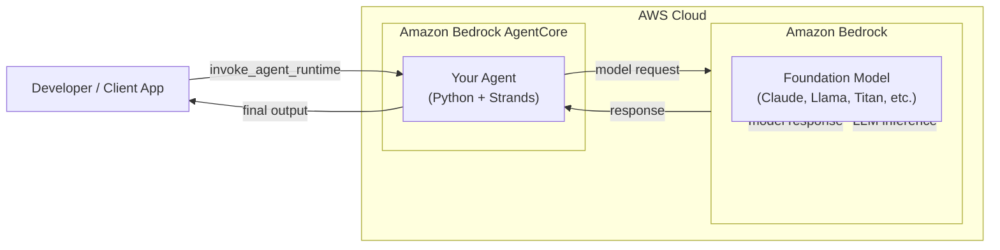
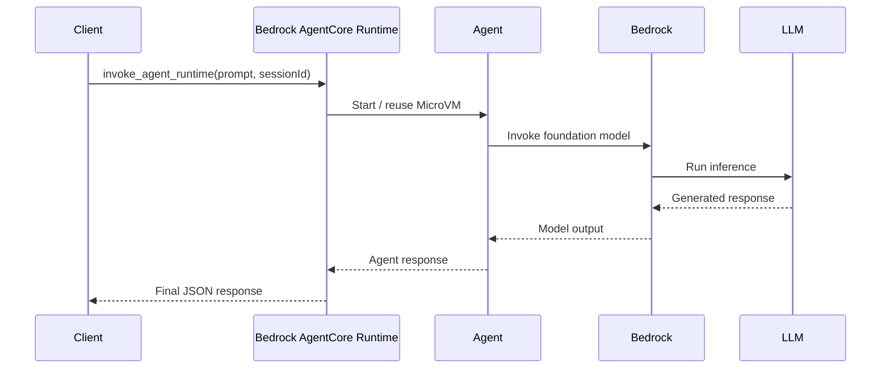

# Bedrock AgentCore Runtime – Quickstart (Agentic AI with Python & Docker)

This repository is a **hands-on, end-to-end quickstart** for building and deploying an **Agentic AI application** using **Amazon Bedrock AgentCore**.

You will:

* Build a simple AI agent in Python
* Run it locally
* Package and deploy it to **Amazon Bedrock AgentCore Runtime**
* Invoke it via CLI and programmatically using `boto3`

This guide is designed for **cloud engineers, developers, and platform teams** looking to get started with **Agentic AI on AWS**.

---

## 🧰 Tech Stack

* **Python 3.10+**
* **Amazon Bedrock AgentCore**
* **Bedrock AgentCore Starter Toolkit**
* **Strands (agent framework)**
* **Docker** (required on Apple Silicon)
* **AWS IAM**
* **AWS Kiro IDE** (used during development)

---

## ⚠️ Important Note for Mac (M1 / M2 / M3)

The `strands` package **does not provide ARM64 wheels** and **AgentCore Direct Code Deploy disables source builds**.

➡️ **Result:** Direct deploy will time out on Apple Silicon.

✅ **Solution:** Use **container deployment** (Docker).
This guide assumes **container deployment** for reliability.

---

## Conceptual Architecture


### Explanation
- Your Agent runs inside Bedrock AgentCore
- AgentCore is the managed runtime (sessions, isolation, lifecycle)
- Amazon Bedrock provides access to Foundation Models
- Your agent does not host or manage the LLM — it calls Bedrock
- AgentCore handles scaling, isolation, and execution
- This diagram is especially useful for people coming from Lambda, ECS and traditional microservices architectures

## Request -> Response flow



## Prerequisites

Before starting, ensure you have:

* An AWS account
* An IAM role or user with:

  * `AmazonBedrockFullAccess`
  * `AmazonECRFullAccess`
  * `IAMPassRole`
* Docker installed and running
* Python 3.10+
* AWS credentials configured


### Configure AWS credentials

#### Generate Bedrock API Key

1. Go to the **User > Securty credentials** tab
2. Scroll down to the section **API keys for Amazon Bedrock**
3. Click **Generate API Key**

#### Add API Key to environment

The API Key then needs to be exported in your terminal window as an environment variable.

```bash
export AWS_BEARER_TOKEN_BEDROCK=<INSERT BEDROCK API KEY>
```

<!-- 
### Configure AWS credentials

```bash
aws configure
```

Or export credentials explicitly:

```bash
export AWS_ACCESS_KEY_ID=xxxxxxxx
export AWS_SECRET_ACCESS_KEY=xxxxxxxx
export AWS_REGION=us-east-1
``` -->

---

## Step 1: Create Project & Virtual Environment

```bash
mkdir agentcore-runtime-quickstart
cd agentcore-runtime-quickstart

python3 -m venv .venv
source .venv/bin/activate
```

---

## Step 2: Install Dependencies

```bash
pip install bedrock-agentcore strands-agents bedrock-agentcore-starter-toolkit
```

Verify installation:

```bash
agentcore --help
```

---

## Step 3: Create the Agent

```bash
touch agent.py requirements.txt
```

### `agent.py`

```python
from bedrock_agentcore import BedrockAgentCoreApp
from strands import Agent

app = BedrockAgentCoreApp()
agent = Agent()

@app.entrypoint
def invoke(payload):
    user_message = payload.get("prompt", "Hello! How can I help you today?")
    result = agent(user_message)
    return {"result": result.message}

if __name__ == "__main__":
    app.run()
```

### `requirements.txt`

```text
bedrock-agentcore
strands-agents
```

---

## Step 4: Run the Agent Locally

```bash
python3 agent.py
```

From another terminal:

```bash
curl -X POST http://localhost:8080/invocations \
  -H "Content-Type: application/json" \
  -d '{"prompt": "Hello!"}'
```

Expected response:

```json
{
  "result": {
    "role": "assistant",
    "content": [
      {
        "text": "Hello! How can I help you today?"
      }
    ]
  }
}
```

Stop the agent with **Ctrl + C**.

---

## Step 5: Configure for Bedrock AgentCore Deployment

Use the AgentCore Starter Toolkit:

```bash
agentcore configure -e agent.py
```

### Recommended choices

* Agent name → default
* Requirements file → `requirements.txt`
* **Deployment type → Container**
* Execution role → default / existing
* ECR repository → auto-create
* Authorization → default
* Memory → skip (`s`)

> 💡 Container deployment avoids ARM64 dependency issues on Mac.

This generates an `agentcore.yaml`.

---

## Step 6: Launch the Agent in Bedrock AgentCore Runtime

```bash
agentcore launch
```

Your agent is now running in **Amazon Bedrock AgentCore Runtime**.

---

## Step 7: Invoke the Agent via CLI

```bash
agentcore invoke '{"prompt": "Tell me a joke"}'
```

Example response:

```json
{
  "result": {
    "role": "assistant",
    "content": [
      {
        "text": "Why don’t scientists trust atoms? Because they make up everything."
      }
    ]
  }
}
```

---

## Step 8: Invoke the Agent Programmatically (Python)

Create a client:

```bash
touch client.py
```

### `client.py`

```python
import json
import uuid
import boto3

agent_arn = "<YOUR_AGENT_RUNTIME_ARN>"
prompt = "Tell me a joke"

client = boto3.client("bedrock-agentcore")

payload = json.dumps({"prompt": prompt}).encode()

response = client.invoke_agent_runtime(
    agentRuntimeArn=agent_arn,
    runtimeSessionId=str(uuid.uuid4()) + str(uuid.uuid4()),  # must be 33+ chars
    payload=payload
)

content = []
for chunk in response.get("response", []):
    content.append(chunk.decode("utf-8"))

print(json.loads("".join(content)))
```

Run it:

```bash
python3 client.py
```

---

## Step 9: Clean Up

To fully remove the agent from Bedrock:

```bash
agentcore destroy
```

This immediately invalidates all sessions and runtime access.

---

## What You Learned

* How to build a simple **Agentic AI application**
* How Bedrock AgentCore runtimes work
* Why **container deployment** is essential on Apple Silicon
* How to invoke agents via CLI and code
* How session IDs map to microVM lifecycles

---

## Next Steps

* Add tools and actions to your agent
* Connect external APIs
* Add memory or state
* Secure invocation with IAM or network controls

---

## Final Thoughts

AgentCore provides a **clean, production-ready runtime** for Agentic AI on AWS.
Once you understand the deployment model and dependency constraints, it becomes a powerful foundation for real-world AI systems.

Happy building 🚀
