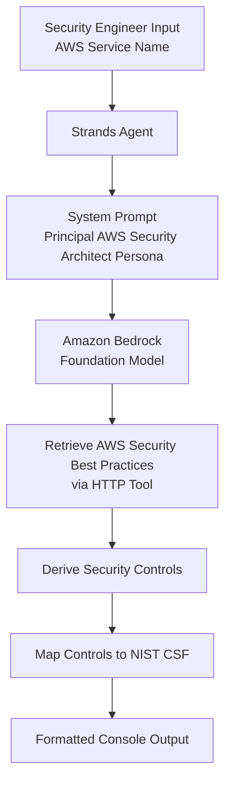

# AWS Service Security Evaluation Agent

This project provides a simple AI-powered security evaluation agent that assesses AWS services against **AWS Security Best Practices** and maps them to relevant **NIST Cybersecurity Framework (CSF)** controls.

The agent is built using **Strands Agents** and **Amazon Bedrock**, and is designed to behave like a **Principal AWS Cloud Security Architect**, producing clear, actionable, and engineer-ready security guidance.

---

## 🚀 What This Agent Does

When you provide the name of an AWS service (for example: `S3`, `EC2`, `RDS`, `Lambda`, or `Amazon M2`), the agent will:

- Retrieve AWS Security Best Practices for the service
- Translate those practices into clear security controls
- Provide implementation guidance using AWS-native features
- Map each control to the relevant **NIST CSF control reference**
- Output results in a clean, console-friendly format

This makes it ideal for:

- Security architecture reviews
- Cloud assurance and compliance checks
- Internal security tooling or proofs of concept
- Agentic security platforms and demos

---

## 🧱 Architecture Overview (AWS Bedrock Agent Core Aligned)

This implementation maps closely to **AWS Bedrock Agent Core** concepts, even though it is implemented using the lightweight **Strands Agents** framework.

| Concept         | This Project    | AWS Bedrock Equivalent             |
| --------------- | --------------- | ---------------------------------- |
| Agent persona   | `SYSTEM_PROMPT` | Agent instructions / system prompt |
| LLM execution   | `Agent()`       | Bedrock foundation model           |
| Tool invocation | `http_request`  | Agent Core tools / action groups   |
| User input      | CLI prompt      | Agent invocation input             |

### Logical Flow



This mirrors how a Bedrock Agent Core agent:

- Receives input
- Applies instructions and guardrails
- Calls tools for retrieval
- Produces structured output

---

## 📋 Prerequisites

This guide is written for **security engineers and cloud engineers** who want to evaluate AWS services using an agentic, best-practice-driven approach.

Before you begin, ensure you have:

- Python **3.9+** installed
- An **AWS account** with access to Amazon Bedrock
- IAM permissions to:

  - Invoke Bedrock foundation models
  - Generate and use a Bedrock API key

---

## 📦 Installation

### 1. Create and activate a virtual environment (recommended)

```bash
python3 -m venv .venv
source .venv/bin/activate
```

### 2. Install required dependencies

```bash
pip install strands-agents
pip install strands-agents-tools
```

---

## 🔐 Amazon Bedrock Setup

This section is critical. Amazon Bedrock **requires explicit enablement, model access, and API key configuration**.

### 1. Enable Amazon Bedrock and Model Access

1. Sign in to the **AWS Management Console**
2. Navigate to **Amazon Bedrock**
3. Select **Model access** in the left navigation
4. Enable access to your chosen foundation model (for example, Anthropic Claude)

> ⚠️ Model access approval may take several minutes

---

### 2. Create an IAM User for Bedrock API Access

For local development, it is recommended to use a **dedicated IAM user** with least-privilege permissions.

1. Open the **IAM Console**
2. Create a new IAM user (for example: `bedrock-agent-user`)
3. Select **Programmatic access**
4. Attach a policy that allows Bedrock invocation

Example minimum policy:

```json
{
  "Version": "2012-10-17",
  "Statement": [
    {
      "Effect": "Allow",
      "Action": [
        "bedrock:InvokeModel",
        "bedrock:InvokeModelWithResponseStream"
      ],
      "Resource": "*"
    }
  ]
}
```

---

### 3. Generate a Bedrock API Key (Important)

Amazon Bedrock uses a **dedicated API key** mechanism in addition to standard AWS credentials.

1. In the **AWS Management Console**, navigate to **Amazon Bedrock**
2. Choose **API keys** from the left-hand menu
3. Create a new API key
4. Copy the key securely — it will not be shown again

---

### 4. Export Required Environment Variables

Export **both** AWS credentials and the Bedrock API key:

```bash
export AWS_ACCESS_KEY_ID="<your-access-key>"
export AWS_SECRET_ACCESS_KEY="<your-secret-key>"
export AWS_DEFAULT_REGION="us-east-1"

export AWS_BEARER_TOKEN_BEDROCK="<your-bedrock-api-key>"
```

> 💡 If running on AWS infrastructure with IAM roles, only the Bedrock API key is required

---

### 2. Create or configure AWS credentials

Ensure your AWS credentials are configured locally using **one** of the following methods:

#### Option A: AWS CLI (recommended)

```bash
aws configure
```

Provide:

- AWS Access Key ID
- AWS Secret Access Key
- Default region (for example: `us-east-1`)

#### Option B: Environment variables

```bash
export AWS_ACCESS_KEY_ID="your-access-key"
export AWS_SECRET_ACCESS_KEY="your-secret-key"
export AWS_DEFAULT_REGION="us-east-1"
```

> 💡 If you are using IAM roles (EC2, ECS, etc.), explicit credentials are not required

---

## ▶️ Running the Agent

Save the Python script (for example: `security_agent.py`) and run:

```bash
python3 security-agent.py
```

You will be prompted:

```text
What AWS Service do you require a security evaluation for ?
```

Example input:

```text
S3
```

---

## 📤 Example Output (Excerpt)

```text
AWS Service: Amazon S3

Security Controls:

1. Enforce Least Privilege Access to S3 Buckets
   Objective:
   - Prevent unauthorised access to sensitive data stored in S3

   Implementation Guidance:
   - Use IAM policies and S3 bucket policies with explicit permissions
   - Enable S3 Block Public Access at the account and bucket level

   Security Framework References:
   - NIST CSF PR.AC-4
```

---

## 🧠 Understanding Strands Agents (For Security Engineers)

**Strands** is a lightweight agent framework that provides:

- Explicit system prompts (agent persona)
- Deterministic tool invocation
- Minimal abstraction over the underlying LLM

This makes it ideal for **security engineering use cases**, where:

- Predictability matters more than creativity
- Outputs must be auditable
- Hallucination risk must be minimised

In this project:

- `Agent(system_prompt=...)` defines the **security architect role**
- `http_request` acts like a **Bedrock Agent Core tool**
- The agent performs retrieval + reasoning in a single execution loop

Conceptually, this is equivalent to a **single-agent Bedrock Agent Core deployment**, without managed orchestration.

---

## 🧠 Customisation Ideas

You can extend this agent to:

- Output **strict JSON schemas** for downstream systems
- Map controls to **CIS Benchmarks**, **ISO 27001**, or **ISF SOGP**
- Persist outputs to a database or dashboard
- Add control metadata (Preventive / Detective / Corrective)
- Evolve into a multi-agent security evaluation pipeline

---

## ⚠️ Important Notes

- The agent is constrained to **real AWS features only** and avoids hallucinated services
- Outputs are intended for **security and cloud engineers**
- This project is a **reference implementation / proof of concept**, not a compliance certification

---

## 📄 License

This project is provided for educational and internal use. Review and adapt security guidance before using in production environments.

---

## 🤝 Contributing

Contributions, enhancements, and framework mappings are welcome. Feel free to fork and extend the agent for your own security use cases.
