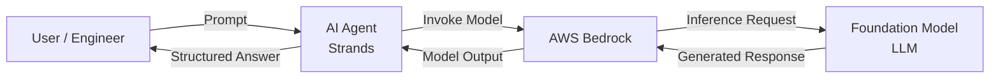

# Tutorial: Building an Enterprise AI Agent using AWS Bedrock and Strands

## Table of Contents

1. [Introduction](#introduction)
2. [Overview](#overview)
3. [Prerequisites](#prerequisites)
4. [Setup Environment](#setup-environment)
5. [Create Agent](#create-agent)
6. [Run Agent](#run-agent)
7. [What's Next ?](#whats-next)

# Introduction

Consider this tutorial the 'Hello, World' AI Agent. 🤖

We'll build a simple AI Agent with Strands that accepts as input an AWS cloud service e.g. `S3` and returns the Security Best Practices including technical implementation guidance.

In addition, it will also retrieve relevant Security Controls from a Cyber Security Framework e.g. `NIST CSF`

We will leverage LLMs through AWS's Bedrock service which provides a single unified API endpoint to access foundation models. In this example, Anthropic's Claude will be used.

The purpose of this tutorial is to help you get up and running with your first AI Agent.

## What we're going to build


## Overview

The diagram below illustrates the high-level flow of a user request through an AI Agent built with Strands, leveraging AWS Bedrock to access a large language model (LLM).



# Prerequisites

The first thing we need to do is ensure that we have an identity that can authenticate with AWS Bedrock to gain access to the LLM.

### Step 1: Create IAM User

This is so we can generate a Bedrock API Key required to access Bedrock's LLM that the Agent will use.

1. Sign into AWS management console
2. Navigate to IAM User
3. Create user: `bedrock-api`
4. Next, Attach policies directly
5. Select policy `AmazonBedrockFullAccess`
6. Create User

> Securty Note: This is for demo purposes only. For Production deployment you'll want to use least privilege and use a custom policy with the action: `bedrock:InvokeModelWithResponseStream`

### Step 2: Generate Bedrock API Key

1. Go to the **User > Securty credentials** tab
2. Scroll down to the section **API keys for Amazon Bedrock**
3. Click **Generate API Key**

### Step3: Add API Key to environment

The API Key then needs to be exported in your terminal window as an environment variable.

```bash
export AWS_BEARER_TOKEN_BEDROCK=<INSERT BEDROCK API KEY>
```

> AWS SDK note
>
> - This project uses the AWS SDK for Python (boto3) indirectly through the Strands framework.
> - You do not need to install the AWS SDK separately — it is installed automatically as a dependency of Strands.
> - Authentication is handled using standard AWS credential resolution. In this tutorial we use a Bedrock API key exported as an environment variable.

## Setup Environment

### Step 1: Initialise Project Directory

Let's create a project folder called `security-agent` and in here we will create our Agent file: `security-agent.py`

```bash
# Create folder for your project
mkdir security-agent
cd security-agent
```

### Step 2: Install Python

Since most AI Agents are coded in Python and the support and documentation is Python-orientated, we will also build our first Agent in Python.

To begin, let's open up a terminal window and run the following command:

```bash
brew install python
```

Verifying installation by running: `python3 --version`

```bash
# The latest version of python will be returned
Python 3.14.0
```

### Step 3: Create and activate a virtual environment

It’s recommended to use a Python virtual environment to keep dependencies isolated.

```bash
# Create a virtual environment in the project folder
python3 -m venv .venv

# Activate the virtual environment
source .venv/bin/activate
```

### Step 4: Install the Strands packages

This installs the Strands Python package and makes its modules (like strands.Agent) available for use in your project.

```bash
pip install strands-agents
pip install strands-agents-tools
```

> These commands install:
>
> - `strands-agents` -> the main agent framework (e.g., `Agent` class)"
> - `strands-agents-tools` -> helper tools like `http_request` used for retrieval"

Verify installation:

```bash
pip show strands-agents
```

# Create Agent

### Step 1: Create Agent file

```bash
# Create Agent file
touch security-agent.py
```

### Step 2: Import Strands

```python
# Import Strands Packages
from strands import Agent
from strands_tools import http_request

# Create a System Prompt to be the Agent Persona
SYSTEM_PROMPT = '''You are a principal AWS Cloud Security Architect.

Your role is to assess AWS services from a security best-practice perspective and present clear, actionable security controls.

When given the name of an AWS service (for example: S3, EC2, RDS, Lambda, or Amazon M2), you must:

1. Identify the official AWS Security Best Practices relevant to that service.
   - Prioritise AWS documentation, Well-Architected Framework (Security Pillar), and AWS service security guides.
   - Focus on preventive, detective, and corrective controls.

2. Translate those best practices into clear, vendor-aligned security controls.
   - Each control must have:
     - A concise control title
     - A clear security objective (what risk it mitigates and why it matters)
     - Practical implementation guidance specific to AWS

3. Present the output in a structured, readable console format.
   - Use numbered controls
   - Use short bullet points for guidance
   - Avoid marketing language
   - Be precise and technically accurate

4. Retrieve the relevant security control from the NIST CSF.

### Output format (strictly follow):

AWS Service: <SERVICE_NAME>

Security Controls:

1. <Control Title>
   Objective:
   - <What security risk this control mitigates>

   Implementation Guidance:
   - <Specific AWS configuration or service>
   - <Relevant AWS feature or setting>
   - <Optional validation or monitoring approach>

   Security Framework References:
   - <Security Control reference ID>

2. <Next Control>
   ...

### Constraints:
- Do NOT invent AWS features or configurations.
- If best practices are limited or service-specific, state that clearly.
- Prefer clarity and correctness over completeness.
- Assume the audience is a cloud engineer or security engineer.

If the service name is ambiguous or deprecated, ask for clarification before proceeding.
'''

# Instantiate the Agent
agent = Agent(system_prompt=SYSTEM_PROMPT, tools=[http_request])

# Prompt for User input
user_input = input("What AWS Service do you require a security evaluation for ? ")

# We will call our AI Agent 'Buzz'
print("\n Buzz:")

# Call the Agent with the User input e.g. AWS S3
agent(user_input)

```

# Run Agent

Simply type:

```bash
python3 security-agent.py
```

Enter a service e.g. S3

```bash
"What AWS Service do you require a security evaluation for ?" s3

 Buzz:
"I'll help you identify the AWS Security Best Practices for Amazon S3 and translate them into clear, actionable security controls. Let me first gather the official AWS security documentation for S3."
Tool #1: http_request
"Let me try the correct AWS S3 security documentation URL:"
Tool #2: http_request
"Now let me also retrieve information about NIST CSF security controls to map the S3 security practices to appropriate framework references:"
Tool #3: http_request
"Based on the official AWS S3 security documentation I retrieved, I'll now present the structured security controls assessment for Amazon S3. Since I couldn't access the specific NIST CSF control details, I'll reference the appropriate NIST CSF function areas based on my knowledge of the framework."
```

Agents Response (in Markdown):

```
## AWS Service: Amazon S3

### Security Controls:

**1. Block Public Access Configuration**

Objective:

- Prevents unauthorized public access to S3 buckets and objects
- Mitigates data breach risk from misconfigured public permissions

Implementation Guidance:

- Enable S3 Block Public Access at the account and bucket level
- Use organization-level Block Public Access via AWS Organizations
- Monitor compliance using s3-bucket-public-read-prohibited and s3-bucket-public-write-prohibited Config rules
- Review bucket policies for wildcard principals ("\*")

Security Framework References:

- NIST CSF: PR.AC-3 (Access Control), PR.AC-4 (Access Permissions)

**2. Disable Access Control Lists (ACLs)**

Objective:

- Simplifies permissions management and reduces misconfiguration risks
- Enforces policy-based access control over legacy ACL mechanisms

Implementation Guidance:

- Set S3 Object Ownership to "Bucket owner enforced"
- Migrate from ACL-based to IAM policy-based access control
- Review and update bucket policies before disabling ACLs
- Use IAM policies, bucket policies, and VPC endpoint policies for access control

Security Framework References:

- NIST CSF: PR.AC-1 (Identity and Access Management)

**3. Implement Least Privilege Access**

Objective:

- Minimizes attack surface by granting only necessary permissions
- Reduces impact of compromised credentials or insider threats

Implementation Guidance:

- Use specific S3 actions in IAM policies rather than wildcards
- Implement IAM permission boundaries
- Apply resource-level permissions using ARNs
- Regular access reviews and policy audits

Security Framework References:

- NIST CSF: PR.AC-4 (Access Permissions), PR.PT-3 (Principle of Least Functionality)

**4. Enforce Encryption at Rest**

Objective:

- Protects stored data from unauthorized access if storage media is compromised
- Ensures compliance with data protection regulations

Implementation Guidance:

- Use default SSE-S3 encryption (enabled by default)
- Configure SSE-KMS for enhanced key management and audit trails
- Consider DSSE-KMS for dual-layer encryption for sensitive data
- Disable SSE-C for new buckets (best practice)

Security Framework References:

- NIST CSF: PR.DS-1 (Data-at-rest Protection)

**5. Enforce Encryption in Transit**

Objective:

- Prevents eavesdropping and man-in-the-middle attacks
- Ensures data confidentiality during transmission

Implementation Guidance:

- Use aws:SecureTransport condition in bucket policies to deny HTTP requests
- Configure CloudWatch alarms for HTTP access attempts
- Avoid TLS certificate pinning (AWS manages certificate rotation)
- Use s3-bucket-ssl-requests-only Config rule for monitoring

Security Framework References:

- NIST CSF: PR.DS-2 (Data-in-transit Protection)

**6. Enable Versioning and Object Lock**

Objective:

- Protects against accidental deletion and ransomware attacks
- Provides WORM (Write Once Read Many) compliance capabilities

Implementation Guidance:

- Enable S3 Versioning on all buckets
- Configure S3 Object Lock for compliance and retention requirements
- Use s3-bucket-versioning-enabled Config rule
- Implement lifecycle policies to manage version costs

Security Framework References:

- NIST CSF: PR.DS-6 (Integrity Checking Mechanisms), PR.IP-4 (Backups)

**7. Implement Comprehensive Monitoring and Logging**

Objective:

- Enables detection of suspicious activities and security incidents
- Provides audit trails for compliance and forensic analysis

Implementation Guidance:

- Enable S3 server access logging
- Configure CloudTrail for S3 data events
- Use cloudtrail-s3-dataevents-enabled Config rule
- Monitor CloudWatch metrics (PutRequests, GetRequests, 4xxErrors)
- Enable AWS Config for resource configuration monitoring

Security Framework References:

- NIST CSF: DE.AE-3 (Event Data Aggregation), DE.CM-1 (Network Monitoring)

**8. Use IAM Roles for Service Access**

Objective:

- Eliminates long-term credentials and reduces credential exposure risk
- Provides temporary, automatically rotating access credentials

Implementation Guidance:

- Use IAM roles for EC2 instances accessing S3
- Configure cross-service IAM roles for AWS services
- Avoid embedding access keys in application code
- Implement role session policies for additional restrictions

Security Framework References:

- NIST CSF: PR.AC-1 (Identity and Access Management), PR.AC-7 (Authenticator Management)

**9. Implement Cross-Region Replication**

Objective:

- Provides disaster recovery and business continuity capabilities
- Protects against regional failures and compliance requirements

Implementation Guidance:

- Configure S3 Cross-Region Replication (CRR) for critical data
- Ensure versioning is enabled on source and destination buckets
- Use s3-bucket-replication-enabled Config rule
- Consider Same-Region Replication (SRR) for compliance requirements

Security Framework References:

- NIST CSF: PR.IP-4 (Backups), RC.RP-1 (Recovery Plan)

**10. Use VPC Endpoints for Private Access**

Objective:

- Prevents data exfiltration through internet gateways
- Provides network-level access control and traffic isolation

Implementation Guidance:

- Deploy VPC endpoints for S3 in private subnets
- Configure VPC endpoint policies to restrict access
- Use condition keys in bucket policies to allow VPC endpoint access only
- Monitor VPC Flow Logs for traffic analysis

Security Framework References:

- NIST CSF: PR.AC-5 (Network Access Control), PR.DS-5 (Data Leak Prevention)

**11. Deploy Managed Security Services**

Objective:

- Provides automated threat detection and data classification
- Enhances security monitoring with machine learning capabilities

Implementation Guidance:

- Enable Amazon GuardDuty S3 protection for threat detection
- Use Amazon Macie for sensitive data discovery and classification
- Configure IAM Access Analyzer for external access review
- Integrate with AWS Security Hub for centralized findings management

Security Framework References:

- NIST CSF: DE.CM-8 (Malicious Code Detection), ID.AM-4 (Data/Information Cataloging)%
```

Congratulations, you have created your first AI Agent using AWS and Strands.

# Hosting in Bedrock Agent Core

Now we have our AI Agent running locally, the next step is to have it hosted so it can be accessible from your client application.

# What's next ?

Hopefully this tutorial has shown you how simple it is to build an AI Agent.

The next step will be to create a generalised orchestrator agent that leverages Model Context Protocol (MCP) to access the tools made available from more specialised agents.

For example:

| Agent                    | Description                                                                                       |
| ------------------------ | ------------------------------------------------------------------------------------------------- |
| Cloud Security Architect | Takes an AWS service and retrieves Security Best Practices with technical implementation guidance |
| Cloud Architect          | take an AWS service and output a reference architecture in Terraform                              |
| Cloud Engineer           | takes the Terraform to produce Cloud Policies to enforce Security Controls                        |
| Regulatory Compliance    | checks for regulatory compliance e.g. `SOC2`, `GDPR` etc.                                         |
| Cyber Securty Framework  | Checks for corresponding Security Controls from Framework to match Security Controls for service  |
